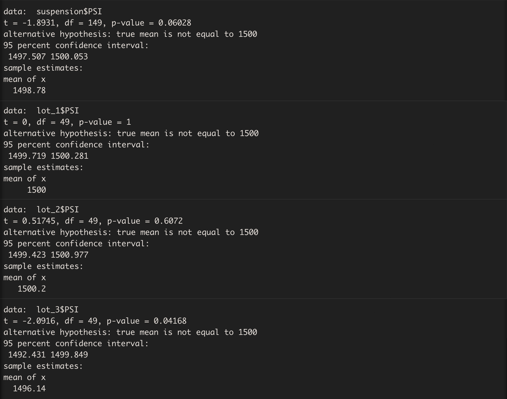

# MechaCar_Statistical_Analysis
## Overview
## Linear Regression to Predict MPG

In this multi-linear regression model we observe significant correlations of vehicle length and ground clearance to MPG.
Linear model slope is not zero as p-value is way below all significance levels and therefore the null hypothesis is rejected. 

The model will predict MechaCar prototypes quite effectively, but there is room for improvement. Although the R-squared value of 0.71 shows the model approximates real-world data points well, the intercept coefficient Pr(>|t|) of 5.08e-08 indicates there are other variables that can help explain the variability of our dependent variable that have not been included in our model. These variables could be engine specifications like size, horse power and torque. 

## Summary Statistics on Suspension Coils 

Current manufacturing data does not meet design specifications. Variance of suspension coils in Lot 3 far exceeds the design specifications limit of 100psi. 
Lot 1 and Lot 2 on the other hand meet the criteria with variances of 0.99 and 7.47 respectively. 

## T-Tests on Suspension Coils

The results of the T-test for the suspension coils across all manufacturing lots shows that they are not statistically different from the population mean, and the p-value is not low enough (0.0603) for us to reject the null hypothesis. This result is reinforced when looking individually at Lot 1 and Lot 2. The results from Lot 3 however show a p-value = 0.042, a value that suggests a  statistical difference to the population mean and that enables us to reject the null hypothesis. 

## Study Design: MechaCar vs Competition

