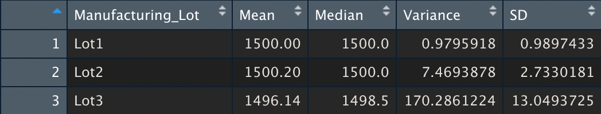

# MechaCar_Statistical_Analysis
## Overview
## Linear Regression to Predict MPG

  
In this multi-linear regression model the most significant variables showing a non-random effect on the MPG are:  
 
**vehicle length /**  Pr(>|t| = 2.6x10-12) 
**ground clearance /**  Pr(>|t| = 5.21x10-8) 
 
Linear model slope is not zero as p-value is below all significance levels and therefore the null hypothesis is rejected. 
  
The model will predict MechaCar prototypes with relative effectiveness, but there is room for improvement. Although the R-squared value of 0.71 shows the model approximates real-world data points well, the intercept coefficient Pr(>|t|) of 5.08x10-8 indicates there are other variables that can help explain the variability of our dependent variable that have not been included in our model. These variables could be engine specifications like size, horse power and torque. 

## Summary Statistics on Suspension Coils 

  

  
Current manufacturing data **does not meet design specifications**. Variance of suspension coils in Lot 3 far exceeds the design specifications limit of 100psi at 170.29 ; Lot 1 and Lot 2 on the other hand meet the criteria with variances of 0.99 and 7.47 respectively. 

## T-Tests on Suspension Coils

   
The results of the T-test for the suspension coils across all manufacturing lots show no statistical difference from the population mean, and the p-value (0.0603) does not allow us to reject the null hypothesis. This result is verified when looking deeper, individually at Lot 1 and Lot 2. The results from Lot 3 however tell a different story as they show a p-value = 0.042, one that suggests a  statistical difference to the population mean and that enables us to reject the null hypothesis. 
      

 
## Study Design: MechaCar vs Competition

